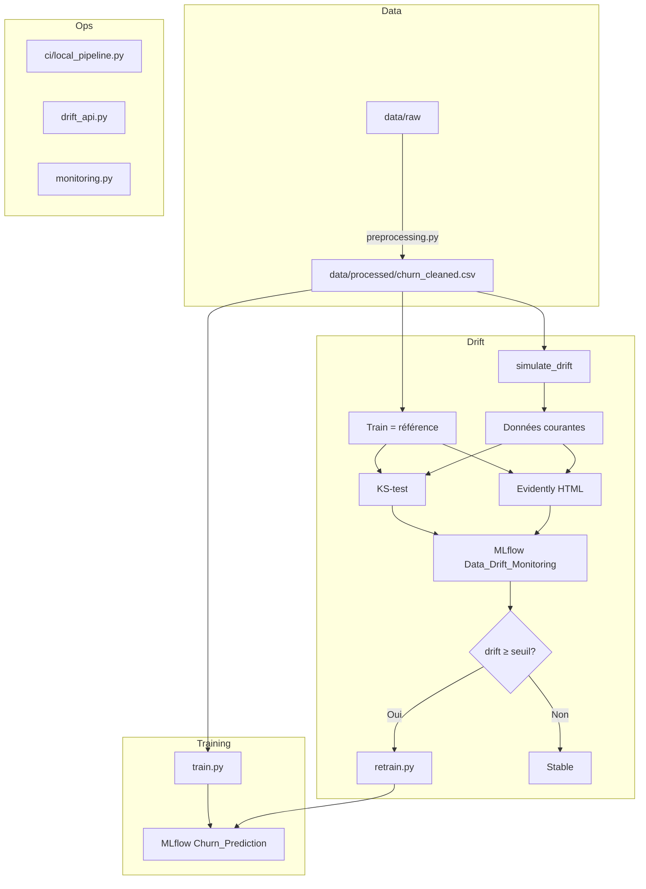

# ProjetML — Prédiction de churn & MLOps

Projet de **machine learning** sur des données clients télécom (Telco Customer Churn) avec un pipeline **MLOps** complet : entraînement multi-modèles, suivi d’expériences **MLflow**, détection de **data drift**, ré-entraînement automatique et **CI/CD local**.

**Dataset :** [Telco Customer Churn (Kaggle)](https://www.kaggle.com/datasets/blastchar/telco-customer-churn)  
**Résultats modèles :** `backendML/models/comparison_results.csv` (après `train.py` + `evaluate.py`)

---

## Fonctionnalités

| Module | Description |
|--------|-------------|
| **Prédiction churn** | Entraînement et comparaison de modèles (KNN, SVM, Random Forest, XGBoost, etc.) |
| **Data drift** | Simulation de dérive, détection KS-test + Evidently, rapports HTML |
| **Ré-entraînement auto** | Déclenché si ≥ 30 % des features dérivent (configurable) |
| **MLflow** | Traçabilité des runs (`Churn_Prediction`, `Data_Drift_Monitoring`) |
| **API REST** | Endpoints drift pour intégration frontend |
| **CI/CD local** | Pipeline de validation avant commit / déploiement |
| **Monitoring** | Vérification périodique du drift en boucle |

---

## Architecture



---

## Structure du projet

```
ProjetML/
├── README.md                    # Ce fichier
├── run_pipeline.py              # CLI principale (detection, ci, api, test…)
├── run_drift_pipeline.bat         # Raccourci Windows
├── ci/                          # CI/CD local
│   ├── local_pipeline.py
│   ├── run.ps1 / run.bat
│   ├── fixtures/                # Échantillon données pour CI
│   └── reports/last_run.json
├── .github/workflows/mlops-ci.yml
│
├── backendML/
│   ├── src/
│   │   ├── preprocessing.py     # Nettoyage & encodage des données
│   │   ├── data_loader.py       # Chargement train/test
│   │   ├── train.py             # Grille d’expériences MLflow
│   │   ├── evaluate.py          # Comparaison des runs
│   │   ├── drift_detection.py   # Pipeline drift principal
│   │   ├── drift_detection_minimal.py
│   │   ├── retrain.py           # Ré-entraînement rapide (XGBoost)
│   │   ├── monitoring.py        # Monitoring continu
│   │   └── drift_api.py         # API REST
│   ├── data/
│   │   ├── raw/                 # CSV source Telco
│   │   └── processed/           # churn_cleaned.csv
│   ├── reports/                 # Rapports drift (HTML, JSON)
│   ├── models/                  # Résultats & manifestes CD
│   ├── requirements_drift.txt
│   └── DRIFT_DETECTION_README.md
│
└── frontendML/                  # Interface (optionnelle)
```

---

## Prérequis

- **Python 3.10+** (testé avec 3.11)
- **Windows / Linux / macOS**
- Fichier de données : `backendML/data/processed/churn_cleaned.csv`  
  (généré via `preprocessing.py` à partir du CSV Telco brut)

---

## Installation

```powershell
# Cloner / ouvrir le projet
cd d:\ProjetML

# Environnement virtuel (recommandé)
python -m venv .venv
.\.venv\Scripts\Activate.ps1

# Dépendances
pip install -r backendML/requirements_drift.txt
```

### Préparer les données (première fois)

```powershell
cd backendML
python src/preprocessing.py
```

Cela produit `data/processed/churn_cleaned.csv` à partir de  
`data/raw/WA_Fn-UseC_-Telco-Customer-Churn.csv`.

---

## Démarrage rapide

### 1. Test minimal du drift (~30 s)

```powershell
cd backendML
python src/drift_detection_minimal.py
```

### 2. Pipeline drift complet

```powershell
cd backendML
python src/drift_detection.py --seuil 0.30
```

Étapes exécutées :
1. Chargement train (référence) / test (simulé en « prod »)
2. Simulation du drift (décalage de moyenne + bruit)
3. Détection **KS-test** (p-value &lt; 0,05 par feature)
4. Rapport **Evidently** → `reports/evidently_drift_report.html`
5. Logging **MLflow** (métriques + artefacts)
6. Si drift ≥ 30 % → **ré-entraînement** via `retrain.py`

Options utiles :

| Option | Description |
|--------|-------------|
| `--seuil 0.30` | Seuil de drift pour déclencher le retrain (défaut 30 %) |
| `--noise 0.3` | Intensité de la simulation |
| `--no-retrain` | Détection seule, sans ré-entraînement |

### 3. Entraînement multi-modèles (long)

```powershell
cd backendML
python src/train.py
```

### 4. CI/CD local

```powershell
cd d:\ProjetML
.\ci\run.ps1 -Quick    # ~1 min — avant commit
.\ci\run.ps1           # validation complète
.\ci\run.ps1 -WithCD   # + ré-entraînement + manifeste
```

Ou via la CLI unifiée :

```powershell
python run_pipeline.py ci --quick
python run_pipeline.py ci
```

Rapport : `ci/reports/last_run.json` — détails : [ci/README.md](ci/README.md)

---

## Commandes principales

Toutes les commandes ci-dessous peuvent aussi passer par `run_pipeline.py` à la racine.

| Action | Commande |
|--------|----------|
| Détection drift | `python run_pipeline.py detection` |
| Sans retrain | `python run_pipeline.py detection --no-retrain` |
| Monitoring boucle | `python run_pipeline.py monitoring --interval 3600` |
| API drift | `python run_pipeline.py api` |
| Tests intégrés | `python run_pipeline.py test` |
| CI local | `python run_pipeline.py ci` |
| MLflow UI | `cd backendML` puis `mlflow ui` |

**Windows (batch)** : `run_drift_pipeline.bat detection`

---

## MLflow

| Expérience | Contenu |
|------------|---------|
| `Churn_Prediction` | Runs d’entraînement (accuracy, F1, modèles) |
| `Data_Drift_Monitoring` | Runs de drift (`drift_share_ks`, `drift_share_evidently`, artefacts) |

```powershell
cd backendML
mlflow ui
```

Ouvrir http://127.0.0.1:5000

---

## API REST (drift)

```powershell
cd backendML
python src/drift_api.py
```

| Endpoint | Description |
|----------|-------------|
| `GET /api/drift/latest` | Dernières métriques KS + Evidently |
| `GET /api/drift/ks-details` | Détail p-value par feature |
| `GET /api/drift/report` | Chemin du rapport HTML |
| `GET /api/health` | Santé du service |

Port par défaut : **5001** (`DRIFT_API_PORT`).

---

## Livrables générés

| Fichier | Description |
|---------|-------------|
| `backendML/reports/evidently_drift_report.html` | Rapport visuel Evidently |
| `backendML/reports/ks_test_details.json` | Statistiques KS par colonne |
| `backendML/reports/drifted_columns.json` | Liste des features driftées |
| `backendML/models/ci_deploy_manifest.json` | Manifeste après CI/CD `--with-cd` |
| `ci/reports/last_run.json` | Rapport du dernier run CI |

---

## Stack technique

- **Python** — pandas, scikit-learn, XGBoost, scipy  
- **Evidently** — rapports de data drift  
- **MLflow** — tracking d’expériences et modèles  
- **Flask** — API REST  
- **GitHub Actions** — CI distant (`.github/workflows/mlops-ci.yml`)

---

## Documentation complémentaire

| Fichier | Sujet |
|---------|--------|
| [backendML/DRIFT_DETECTION_README.md](backendML/DRIFT_DETECTION_README.md) | Pipeline drift en détail |
| [ci/README.md](ci/README.md) | CI/CD local |
| [QUICK_START.md](QUICK_START.md) | Commandes prêtes à l’emploi |

---

## Workflow MLOps (résumé)

```
Entraînement initial (train.py)
        ↓
Production / données courantes
        ↓
Détection drift (KS + Evidently) → MLflow
        ↓
   drift_share ≥ 30 % ?
    /              \
  Oui              Non
   ↓                ↓
retrain.py      Continuer avec
(XGBoost)       le modèle actuel
```

En production réelle, remplacer `simulate_drift(X_test)` par le chargement d’un batch client (CSV, base SQL, etc.) ; le reste du pipeline reste identique.

---

## Auteurs & contexte

Projet académique / MLOps — prédiction du **churn** client sur dataset **Telco Customer Churn**, avec accent sur la **détection de dérive des données** et l’**automatisation** (ré-entraînement, CI/CD).
